# 게임 구조 UML — 코드·씬·프리팹 실측본

> 감사 기준: 2026-07-15, Unity `6000.3.16f1`, Git `feature/CombatUI` / `54603b0`
> 범위: `Assets` 아래 C# 189개 전수, `Assets/1.Scripts` 159개 + 프로젝트 Editor 도구 3개 + 외부·데모 27개, 주요 씬·프리팹·ScriptableObject·Behavior Graph·Build Settings·Network Prefab 목록
> 상세 파일별 목록: [script-inventory.md](script-inventory.md)

이 문서는 설계 의도만 옮긴 그림이 아니라 **현재 저장소에서 실제로 확인되는 구조**를 기록한다. 코드 선언, 호출자, Unity YAML 직렬화 참조, Behavior Graph의 커스텀 노드 타입 참조를 서로 대조했다. 따라서 아래 표기 상태를 구분해서 읽어야 한다.

| 표기 | 의미 |
| --- | --- |
| **연결됨** | 현재 씬·프리팹·SO·Behavior Graph에서 직렬화 참조가 확인됨 |
| **구현됨/미연결** | 컴파일되는 코드지만 현재 주요 런타임 에셋에서 사용 증거가 없음 |
| **부분 연결** | 일부 경로만 연결됐거나 필수 참조가 비어 있어 완전한 기능으로 동작하지 않음 |
| **설계 전용** | 문서에는 있으나 현재 코드에는 아직 없음 |
| **외부/데모** | 게임 고유 구조가 아닌 에셋 패키지 또는 Unity 샘플 코드 |

## 1. 한눈에 보는 현재 게임

현재 구현은 Unity Netcode for GameObjects 기반의 **리슨 서버 협동 액션 프로토타입**이다. 플레이어의 입력·이동 표현은 소유 클라이언트가 주도하고, 피해·체력·실드·상태이상·보스 AI·보스 기믹·맵 시드 결정은 서버가 권위를 가진다. 데이터는 주로 ScriptableObject에 두고, 플레이어 행동은 코드 FSM, 보스 행동은 Unity Behavior Graph와 커스텀 Action/Condition 노드로 조립한다.

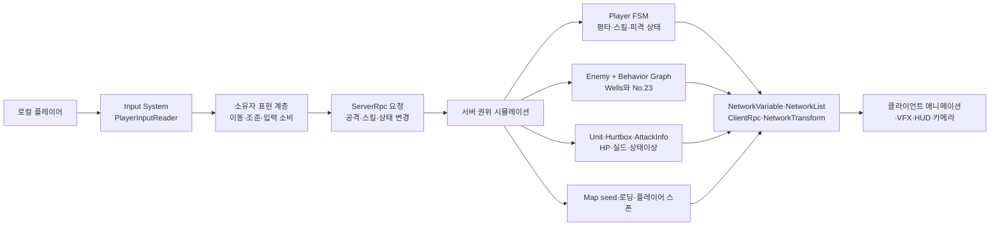

### 구조적 핵심 판단

1. **실제 플레이 가능한 중심은 `PlayerBossTest`**다. Build Settings에 활성화된 씬은 이 씬 하나뿐이다.
2. **일반 실행 흐름 코드**인 `TitleScene → Temp_LobbyScene → LoadingScene → MapScene`은 구현되어 있지만 해당 씬들이 Build Settings에 없어 현재 빌드에서는 완결되지 않는다. 코드 필드 기본값은 `Temp_inGameScene`이나 현재 `NetworkManager.prefab` 직렬화 값은 `MapScene`이다.
3. **플레이어의 현재 기준 프리팹은 `Player.prefab`**이다. `Paladin.prefab`은 스킬 컨트롤러와 Hurtbox가 없는 이전 조립 상태다.
4. **전투 공통 축은 `Unit → Hurtbox/IAttackReceiver → AttackInfo → StatusEffectController`**다. 상속은 얕고 실제 기능은 컴포지션으로 붙는다.
5. **보스는 서버 전용 Behavior Graph**로 판단하고, 공격·잡기·점프·폭탄 같은 물리 결과도 서버에서 만든다.
6. **맵 생성 v2 코드는 존재하지만 현재 `MapScene` 배선은 미완성**이다. `ZoneSlot`과 `ZoneLayoutCatalogSO`가 연결되지 않아 코드 파이프라인이 실질적인 배치를 만들지 못한다.
7. **전투 HUD는 쿨다운 표시까지만 현재 코드에 존재**한다. HP/실드, 상태이상, 머리 위 체력, 보스 HUD는 `PLAN.md`의 후속 설계다.

## 2. 코드베이스 경계와 규모

### 2.1 1차 게임 코드

| 모듈 | 파일 | nonblank LOC | 책임 |
| --- | ---: | ---: | --- |
| `BT` | 49 | 1,915 | Behavior Graph용 Action·Condition·Event 및 네트워크 애니메이션 보조 |
| `Camera` | 2 | 248 | 로컬 플레이어 추적 카메라와 테스트 플레이어 |
| `Enemy` | 24 | 1,533 | 적 공통, Wells/No.23 보스, 폭탄·잡기·점프·차지 공격 |
| `Loading` | 3 | 965 | 네트워크 동기 로딩, 진행률, 수동 PlayerObject 스폰 |
| `Lobby` | 2 | 355 | 3슬롯 준비 상태와 로비 UI |
| `Map` | 27 | 1,958 | 결정론적 맵 배치 v2, 레거시 데이터, 에디터 제작 도구 |
| `Network` | 3 | 108 | 네트워크 활성/권위 추상화, 세션 시작, 프로파일 테스트 |
| `Player` | 24 | 2,775 | 입력·이동·FSM·평타 콤보·스킬 계층·플레이어 표현 |
| `Scene` | 1 | 18 | 실험용 네트워크 씬 스크립트 |
| `SceneFlow` | 2 | 239 | 타이틀 메뉴와 옵션 패널 |
| `UI` | 2 | 81 | 전투 HUD 루트와 스킬 쿨다운 표시 |
| `Unit` | 12 | 1,011 | HP·실드·피해·상태이상·공격 수신·공격 베이스 |
| `Utility` | 8 | 1,539 | 콜라이더 계산, 비트마스크, 편집기/Behavior Graph MCP 보조 |
| `Assets/Editor` | 3 | 253 | SkinnedMesh bounds, Project 창 확장자, 캐릭터 폴더 생성 도구 |
| **프로젝트 코드 합계** | **162** | **12,998** | 1차 런타임·기능 코드와 프로젝트 전용 Editor 코드 |

`Assets/1.Scripts`에는 별도 `.asmdef`가 없다. 따라서 일반 스크립트는 사실상 하나의 `Assembly-CSharp` 경계에 있고, `Editor` 폴더만 Unity 규칙으로 에디터 어셈블리에 분리된다. 기능 디렉터리는 읽기 경계이지 컴파일 의존성 경계는 아니다. `Assets/Editor`의 3개 파일은 Git/rg 기본 검색에서 제외되는 로컬 파일이지만 실제 파일 시스템과 Unity compile 범위에는 존재하므로 전수 목록에 포함했다.

### 2.2 외부·데모 코드

27개는 INab Studio VFX, Starter Assets, ScansFactory Warehouse, Unity TutorialInfo 코드다. INab 일부에는 자체 asmdef가 있지만 게임의 전투·네트워크 도메인에는 속하지 않는다. 이 문서의 UML에서는 외부 표현 계층으로만 나타내며, 전수 파일명은 인벤토리에 따로 기록한다.

### 2.3 주요 패키지 경계

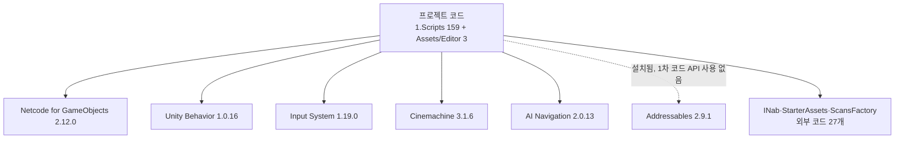

## 3. Unity 에셋 토폴로지

### 3.1 씬과 실행 경로

저장소에는 1차 씬 11개와 INab 데모 씬 8개가 있지만, `ProjectSettings/EditorBuildSettings.asset`에는 `PlayerBossTest.unity`만 활성 등록되어 있다.

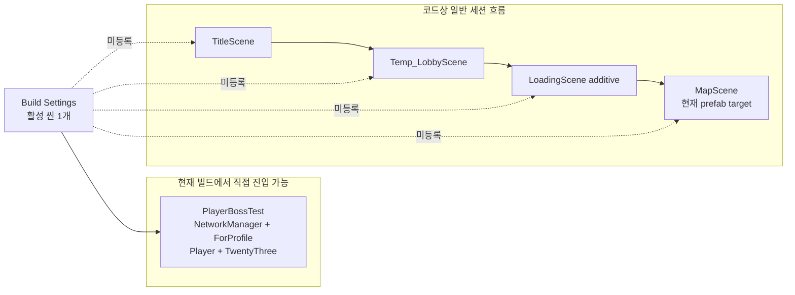

| 씬 | 현재 관찰된 역할 | 상태 |
| --- | --- | --- |
| `PlayerBossTest` | 인씬 NetworkManager, `ForProfile` OnGUI Host 시작, Player 자동 스폰, No.23 보스 테스트 | **Build Settings 연결됨** |
| `PlayerScene` | NetworkManager·Player·카메라·CombatHUD 조립 테스트 | 연결됨, 빌드 미등록 |
| `MapScene` | Stage1, MapGenerator/Sync/Spawner/Validator, 카메라 배치 | 부분 연결, 빌드 미등록 |
| `TitleScene` | 시작·옵션 UI | 코드 연결, 빌드 미등록 |
| `Temp_LobbyScene` | 세션 시작과 3인 준비 로비 | 코드 연결, 빌드 미등록 |
| `LoadingScene` | additive 로딩 진행 UI | 코드 연결, 빌드 미등록 |
| `Temp_inGameScene` | Loading 코드의 필드 기본값이지만 prefab에서 MapScene으로 override됨 | 빌드 미등록 |
| `CamaraScene`, `CameraScene` 계열 | 카메라 실험 | 테스트 |
| `EmptyScene`, `KMKScene`, `all_mesh` | 빈 씬·실험·아트 확인 | 테스트/도구 |

> 2026-07-15 감사 도중 Unity 씬이 동시에 편집되었고 CombatHUD 배치는 최종 재검사 시점에 `PlayerScene`에서만 확인됐다. 이 문서는 씬 파일을 수정하지 않았다.

### 3.2 핵심 프리팹 참조 그래프

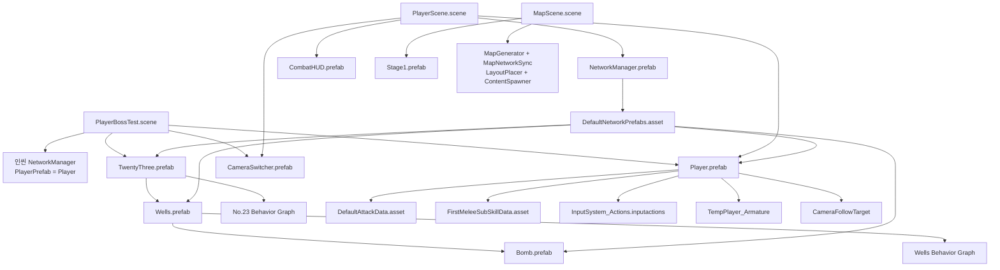

`DefaultNetworkPrefabs.asset`의 9개 항목 중 7개는 `CameraTestPlayer`, `ModularRobots_R1`, `Paladin`, `Player`, `Bomb`, `TwentyThree`, `Wells`로 해석된다. GUID `825afe9d58b0e824aad77b3f53b3788a`, `acd3297eafd80bc48b584442919c791f` 두 항목은 현재 저장소에서 원본을 찾지 못해 정리 대상이다.

## 4. 네트워크 권위 모델

### 4.1 권위 매트릭스

| 영역 | 요청/표현 주체 | 최종 판정·상태 주체 | 복제 방식 |
| --- | --- | --- | --- |
| 입력 | 소유 클라이언트 | 소유 클라이언트가 읽고 RPC 요청 | `PlayerInput`, 로컬 캐시 |
| 플레이어 이동·조준 | 소유 클라이언트 | 현재 프리팹의 owner-authority `NetworkTransform` | NetworkTransform |
| 평타 시작·콤보 | 소유 클라이언트 요청 | 서버 FSM·타이밍·적중 판정 | ServerRpc + ClientRpc |
| 스킬 사용 | 소유 클라이언트 요청 | 서버 쿨다운·상태·효과 판정 | ServerRpc + ClientRpc, 로컬 쿨다운 미러 |
| 피해·HP·실드 | 공격 주체 또는 기믹 | 서버 `Unit` | NetworkVariable 4개 |
| 상태이상 | 서버 | 서버 `StatusEffectController` | NetworkList |
| 보스 AI·NavMesh | 없음 | 서버 Behavior Graph/NavMeshAgent | NetworkTransform + ClientRpc |
| 폭탄·잡기·점프·차지 | 플레이어 공격 입력 일부 | 서버 컨트롤러 | NetworkObject + ClientRpc |
| 맵 시드·난이도 | 서버 | 서버 | NetworkVariable 3개, 양측 결정론 생성 |
| 로비·로딩 | 클라이언트 준비/진행 보고 | 서버 집계·전환 | NGO Custom Messaging |
| 카메라·HUD | 각 클라이언트 | 로컬 전용 | 네트워크 상태 읽기 |

### 4.2 네트워크 기반 클래스

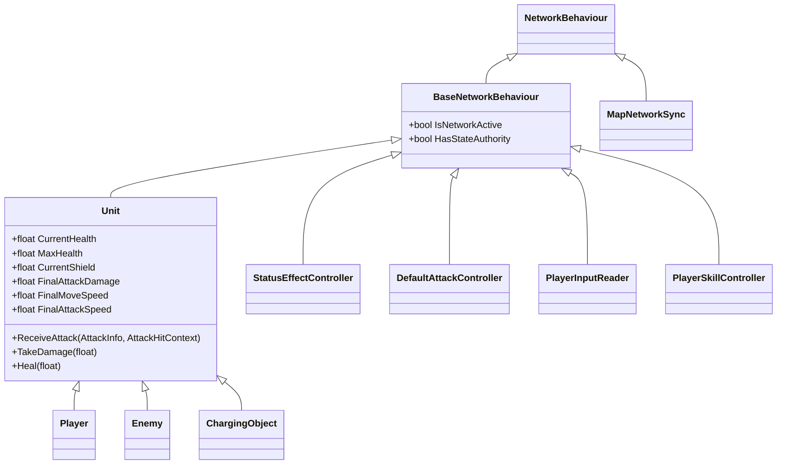

`BaseNetworkBehaviour`는 네트워크 세션이 없을 때도 코드를 실행할 수 있도록 `HasStateAuthority = !IsNetworkActive || IsServer`를 제공한다. 다만 모든 하위 시스템이 이 오프라인 경로를 동일하게 지키는 것은 아니다. 예를 들어 `StatusEffectController`의 쓰기는 실제 Spawn된 서버만 허용해 오프라인 상태이상 적용은 되지 않는다.

### 4.3 RPC·동기 상태 표면

| 소유 클래스 | 서버 RPC | 클라이언트 RPC | 동기 상태 |
| --- | ---: | ---: | --- |
| `Unit` | 8 | 0 | HP, MaxHP, Shield, HasShield NetworkVariable |
| `DefaultAttackController` | 2 | 3 | 서버 FSM + 프레젠테이션 RPC |
| `Player` | 1 | 3 | 잡힘·넉백·표현 RPC |
| `PlayerSkillController` | 3 | 3 | 서버 스킬 상태 + 로컬 쿨다운 미러 |
| `BombController` | 0 | 3 | NetworkObject 수명 + 상태 표현 |
| `ChargeController` | 0 | 1 | 서버 차지 판정 + 표현 |
| `JumpController` | 0 | 2 | 서버 도착점·피해 + 표식 표현 |
| `LinearKnockback` | 0 | 1 | 넉백 표현 |
| `StatusEffectController` | 0 | 0 | `NetworkList<StatusEffectInstance>` |
| `MapNetworkSync` | 0 | 0 | seed, difficulty, ready NetworkVariable |

## 5. 공통 전투 도메인

### 5.1 클래스 구조

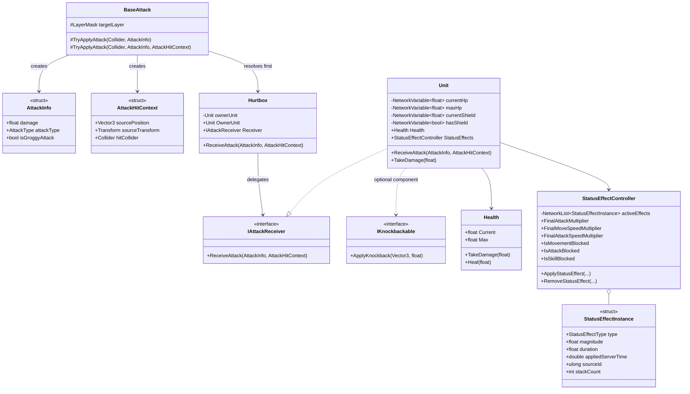

핵심 원칙은 **공격자가 상대의 구체 타입을 몰라도 `IAttackReceiver`로 결과를 전달**하는 것이다. `Hurtbox`는 자식 콜라이더를 소유 Unit 또는 부모의 다른 수신자에 연결한다. 이 덕분에 `Bomb`처럼 `Unit`이 아닌 기믹도 동일한 공격 파이프라인에 들어간다.

### 5.2 적중과 피해 시퀀스

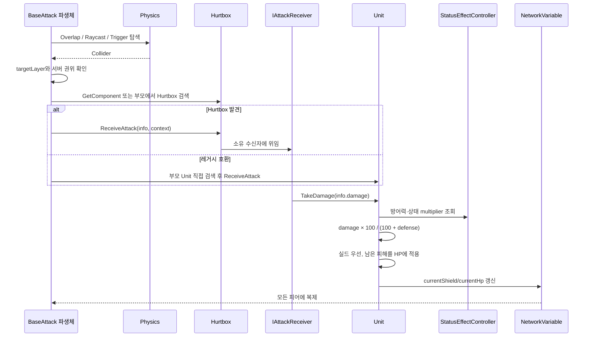

`PlayerDefaultAttack`은 한 번의 판정에서 `HashSet<Unit>`과 `HashSet<Hurtbox>`로 중복 적중을 막고 소유자를 제외한다. `BaseAttack`은 현재 네트워크가 활성화되었으면 서버가 아닌 피어의 판정을 거절한다.

### 5.3 상태이상 계산

동일한 `(StatusEffectType, sourceId)`는 스택을 갱신하고, 다른 source는 공존한다. 최종 스탯은 기본값을 직접 덮어쓰지 않고 활성 효과 배율을 곱해 계산한다.

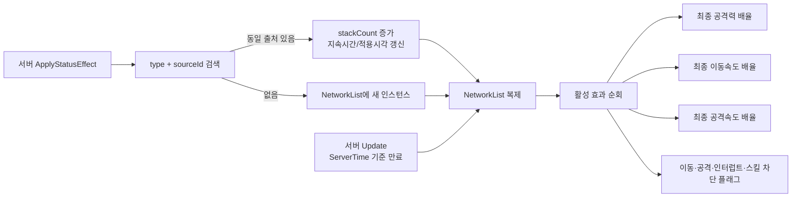

### 5.4 공통 전투의 현재 한계

- `Unit.TakeDamage`의 실드 초과 피해 분배식은 의도와 뒤바뀐 것으로 보인다. 예를 들어 피해 10, 실드 3에서 실드에 7을 적용하고 HP에 3만 남긴다. 일반적인 기대는 실드 3 소진 후 HP 7이다.
- `Health`가 0이 되는 것과 Player FSM의 `Dead` 진입을 연결하는 공통 사망 이벤트가 없다. `Dead`는 generic locked state로 생성 가능하지만 실제 진입 호출자가 없다.
- `StatusEffectController`는 활성 효과 목록을 UI가 열람할 공개 API가 아직 없다. 이는 `PLAN.md` 상태이상 HUD 단계의 선행 작업이다.
- 상태이상 Apply/Remove API의 실제 외부 호출자는 현재 0개다. 컴포넌트와 장부는 연결됐지만 게임플레이 효과를 부여하는 생산자가 없다.
- `Unit.FinalMoveSpeed`, `FinalAttackSpeed`, `FinalDefense`, `FinalMaxHp`는 실제 소비자가 없거나 우회된다. 예를 들어 PlayerMovement는 자체 속도를 쓰고 피해식은 `Health.CurrentDefense`를 직접 읽는다. (`FinalMaxShield`와 MaxShield 개념은 2026-07-16 제거됨 — 실드는 상한 없음)
- `AttackElement`는 enum만 존재하고 현재 피해 계산에는 참여하지 않는다.
- `OverlapAttack`, `LinearKnockback`, `AttackTriggerRelay`는 일반화된 재사용 컴포넌트지만 주요 프리팹 연결이 확인되지 않는다.

## 6. Player 아키텍처

### 6.1 현재 기준 Player 프리팹

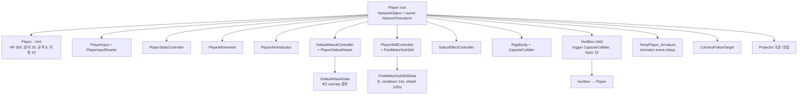

현재 `Player.prefab`에는 E/Sub 스킬만 배선되어 있다. Q/Main, RMB/Interrupt, R/Ultimate 슬롯은 비어 있다. 입력 에셋에는 `Attack=LMB`, `Interrupt=RMB`, `SkillMain=Q`, `SkillSub=E`, `SkillUltimate=R`가 모두 정의되어 있고 `Interact=E`도 중복 정의되지만 현재 상호작용 소비 코드는 없다.

`Paladin.prefab`은 `Player`, 입력, 이동, 상태, 평타, 색상 컴포넌트까지만 있고 Hurtbox와 `PlayerSkillController`가 없다. 네트워크 프리팹 목록에는 남아 있으므로 플레이어 기준 프리팹을 하나로 수렴시키는 것이 안전하다.

### 6.2 Player 클래스·컴포넌트 관계

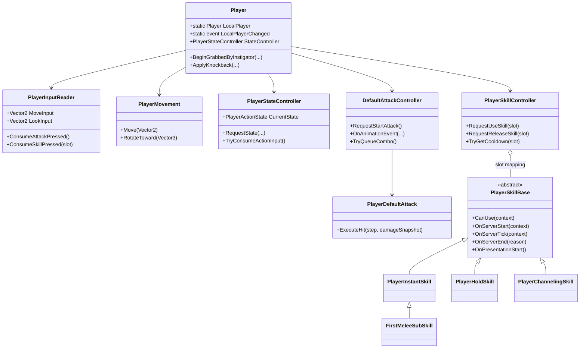

### 6.3 Player FSM

```mermaid
stateDiagram-v2
    [*] --> Idle
    Idle --> Move: 이동 입력
    Move --> Idle: 이동 입력 없음

    Idle --> Attack: Attack 입력, 서버 승인
    Move --> Attack: Attack 입력, 서버 승인
    Attack --> Idle: 콤보 종료
    Attack --> Attack: 콤보 입력 창 + 다음 step

    Idle --> Skill: Q/E/R/RMB 슬롯 입력, 서버 승인
    Move --> Skill: Q/E/R/RMB 슬롯 입력, 서버 승인
    Skill --> Idle: 정상·취소·실패 종료

    Idle --> Interrupt: 스킬 미배정 RMB 레거시 경로
    Move --> Interrupt: 스킬 미배정 RMB 레거시 경로
    Interrupt --> Idle: 종료

    Idle --> Grabbed: 보스 GrabController
    Move --> Grabbed: 보스 GrabController
    Attack --> Grabbed: 강제 상태
    Skill --> Grabbed: 강제 상태
    Grabbed --> Idle: Release

    Idle --> Knockback: IKnockbackable
    Move --> Knockback: IKnockbackable
    Attack --> Knockback: 강제 상태
    Skill --> Knockback: 강제 상태
    Knockback --> Idle: duration 종료

    state Dead
    note right of Dead
      generic locked state는 존재하지만
      HP 0에서 진입시키는 호출자는 없음
    end note
```

Idle/Move 상태의 입력 우선순위는 Attack, 스킬 슬롯, 레거시 Interrupt 순이다. `StatusEffectController`의 blocker가 이동·평타·인터럽트·스킬 진입을 차단한다. Grabbed와 Knockback은 `PlayerLockedState` 계열이고, 수신자 FSM이 자신의 강제 이동 상태를 소유한다.

### 6.4 평타 콤보 시퀀스

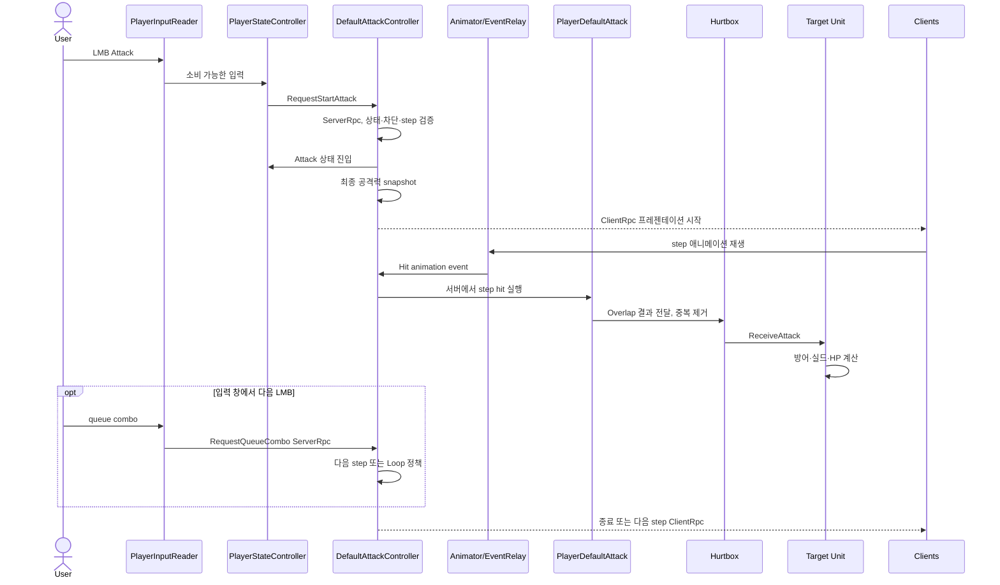

현재 `DefaultAttackData`는 4단 overlap 콤보이고 피해 배율은 `1, 1, 1, 1.2`다. Controller는 애니메이션 이벤트가 누락될 때를 위한 서버 fallback도 가진다. `DefaultAttackProjectile`은 일반 `MonoBehaviour` 기반으로 서버에서 로컬 Instantiate되므로, projectile 변형을 실제로 쓰면 원격 클라이언트가 투사체를 보지 못할 가능성이 높다. 현재 연결된 변형은 overlap이라 이 경로는 잠복 상태다.

### 6.5 스킬 실행 시퀀스

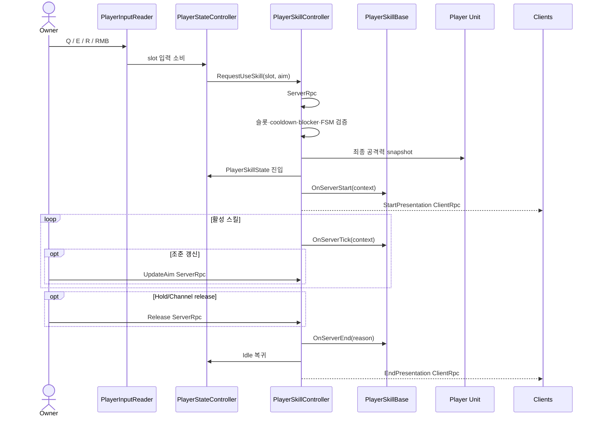

실제 연결된 `FirstMeleeSubSkill`은 Instant 스킬이다. 서버가 10 실드를 적용하고 5초 후 회수하며 cooldown은 14초다. 만료 coroutine은 출처를 식별하지 않고 `SetShield(0)`을 호출하므로 그 사이 다른 효과가 준 실드까지 지울 수 있다. 스킬·평타 시간 추적과 E 실드 coroutine은 현재 `Time.time`을 사용한다. 네트워크 설계 문서가 목표로 제시한 서버 공통 `GameTime` 추상화는 아직 없다.

### 6.6 로컬 표현과 UI 결합

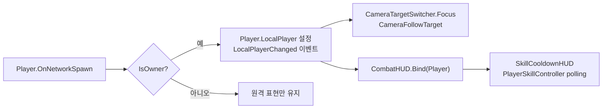

CombatHUD는 LocalPlayer 정적 이벤트에 결합되어 있고 현재 하위 기능은 cooldown 슬롯 표시뿐이다. HP/실드 바, 상태이상 아이콘, Overhead HP, Boss HUD 관련 클래스는 아직 저장소에 없다.

## 7. Enemy와 Behavior Graph

### 7.1 실행 경계

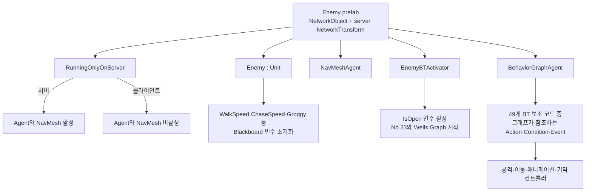

`Enemy`는 `Unit`의 서버 권위 체력·피해를 재사용하고 Behavior Graph blackboard에 속도와 groggy 관련 변수를 주입한다. `RunningOnlyOnServer`는 AI 판단과 NavMesh 이동이 클라이언트에서 중복 실행되지 않게 한다. 보스의 판단 상태는 NetworkVariable로 전부 복제하는 대신 NetworkTransform과 필요한 ClientRpc 프레젠테이션만 복제한다.

### 7.2 Wells와 No.23 프리팹 구성

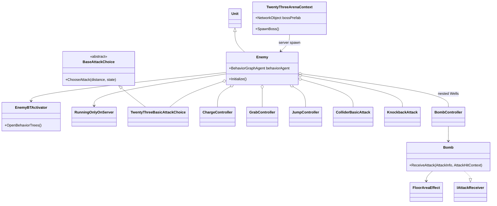

`TwentyThree.prefab`의 주요 수치는 HP 100, 방어 25, 실드 100, 공격 1, 이동 2다. 루트에는 No.23와 Wells용 Behavior Graph Agent, 서버 실행 게이트, BT activator, 기본 공격·차지·잡기·점프 컴포넌트가 있고 Wells 오브젝트가 중첩된다. `Wells.prefab`은 별도 Graph와 `Bomb.prefab` 참조를 가진다.

### 7.3 보스 상태·공격 선택

코드의 실제 `TwentyThreeState`는 다음과 같다.

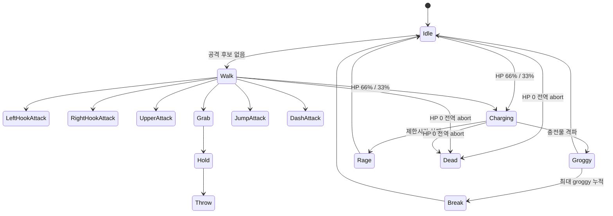

이는 `Docs/design/boss-wells-and-no23.md`의 오래된 상태 목록과 다르다. 문서의 단일 `HookAttack` 대신 코드에는 `LeftHookAttack`과 `RightHookAttack`이 있고, `Hold`, `Throw`, `Rage`가 추가되어 있다. 실제 상태 전이는 Behavior Graph 자산의 분기와 `BossStateChanged` 이벤트 채널이 주도한다.

`TwentyThreeBasicAttackChoice`는 거리 구간과 가중치 목록을 이용해 공격을 선택한다. `WeightedAttack<T>`가 enum과 weight를 묶고, `AddRandomAttackAction`, `RemoveRandomAttackAction`, `GetRamdomAttackTypeAction`이 blackboard 후보 집합을 다룬다.

| 공격 후보 | 거리 범위 | weight | 실제 추가 분기 |
| --- | ---: | ---: | --- |
| Hook | 0–3 | 50 | target 좌우에 따라 Left/Right Hook |
| Upper | 0–3 | 50 | 근거리 |
| Grab | 0–1 | 100 | Throw 후 5초 후보 제거 |
| Jump | 5–10 | 100 | 착지점 예고 후 피해 3 |
| Dash | 10–20 | 100 | 피해 6, 넉백 10 |

`3 < distance < 5`에는 후보가 없어 Walk가 되고, 정확히 10에서는 Jump와 Dash가 동시에 후보가 될 수 있다. HP 66%와 33%에서 charge page가 증가하며, charge 중에는 0.5초마다 HP와 실드를 각각 1 회복한다.

### 7.4 Behavior Graph 자산과 커스텀 노드

확인된 1차 Graph 자산은 `BossArea`, `MonsterArea`, `No.23 BasicAttack Timer`, `No.23`, `Wells`, `CommonMeleeRobot`이다. YAML 타입 문자열 기준으로 46종의 커스텀 타입이 자산에서 참조되지만 모든 Graph가 런타임에 실행되는 것은 아니다.

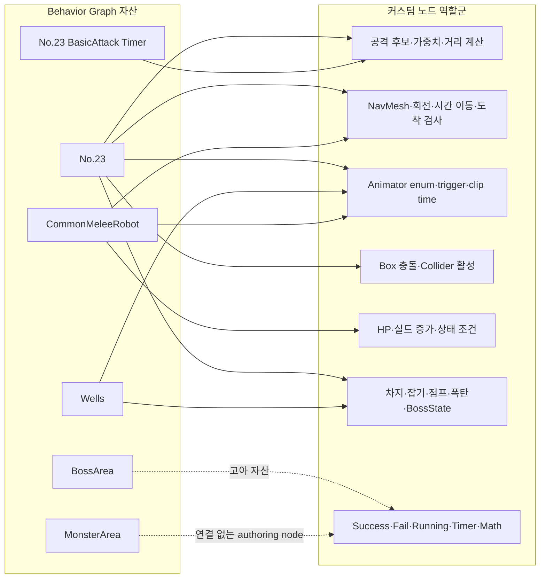

대표 연결은 다음과 같다.

- `CommonMeleeRobot`: 애니메이션 clip 길이, collider 활성, 체력 검사, 거리 계산, animator enum 설정, spawn point 취득.
- `No.23`: delta time 누적, 공격 후보 추가·제거·선택, 좌우 공격 판단, 보스 상태 변경, 차지 시작/도착/격파 조건, 점프·이동·회전·애니메이션·공격 collider 제어.
- `Wells`: Bomb NetworkObject 생성, 들기, 던지기, Wells 상태 제어.
- `BossArea`: fail 반환, 정수 증가, BoxCollider 활성화 노드는 있으나 scene/prefab/다른 Graph 참조가 0인 고아 자산.
- `MonsterArea`: Common authoring 자산에 연결 없는 노드만 있고 runtime graph에는 들어가지 않는다. No.23에는 `WaitingBoss` 변수 흔적만 남았다.

`TwentyThreeArenaContext`는 보스를 Spawn한 직후 `OpenBT()`를 호출한다. 따라서 원래 BossArea가 의도한 “모든 플레이어가 구역에 들어온 뒤 전투 시작” gate는 현재 우회된다. 반면 `No.23`, 그 하위 `No.23 BasicAttack Timer`, `Wells`, `CommonMeleeRobot`, `Boss State Changed`는 실제 프리팹/Graph 경로에서 실행된다.

그래프 자산의 타입 문자열 참조는 일반 `m_Script` GUID 검색에 잡히지 않으므로, 스크립트 사용 여부 판단에는 두 경로를 모두 사용해야 한다.

### 7.5 Bomb 생명주기

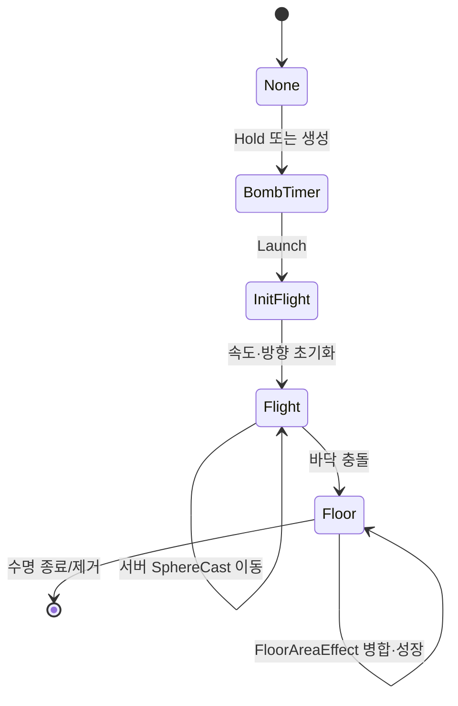

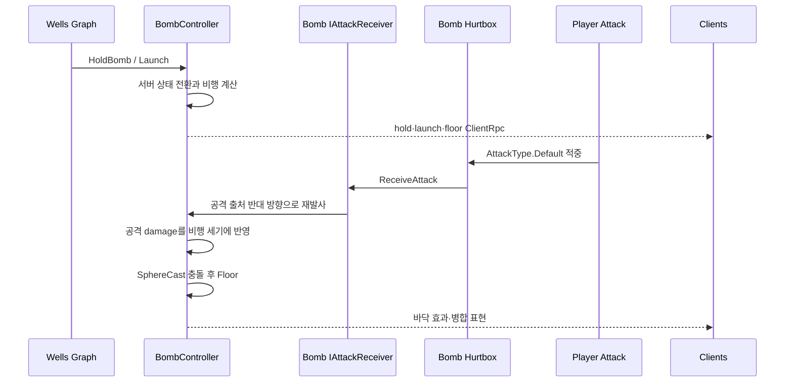

Bomb의 Hurtbox는 `ownerUnit`이 비어 있지만 부모의 `IAttackReceiver`인 `Bomb`을 찾아 정상 위임한다. Bomb은 현재 `AttackType.Default`에만 반응한다. 플레이어가 반사한 폭탄은 source position과 damage로 방향·세기를 계산하고, 바닥에서는 `FloorAreaEffect`가 영역 병합과 성장을 처리한다.

현재 prefab 수치는 fuse 20초, 바닥 지속 30초, 직접 충돌 피해 55와 넉백 5, 장판 피해 11/0.5초다. 다른 HazardArea와 합쳐지면 기존 장판이 0.2씩 최대 2배까지 커지고 타이머가 초기화된다. 비행 중 fuse는 멈춘다. fuse 만료는 반경 폭발을 만들지 않고 mesh를 숨긴 뒤 장판으로 전환할 뿐이다.

### 7.6 Grab·Jump·Charge

```mermaid
flowchart TB
    Grab["GrabController\n서버 Overlap"] --> Target["Player 선택"]
    Target --> GrabState["Player.BeginGrabbedByInstigator"]
    GrabState --> Damage["잡기 단계별 HP 비율 피해"]
    Damage --> Release["Player FSM 해제"]

    Jump["JumpController"] --> Nearest["Player tag 중 최단 대상"]
    Nearest --> Arrive["Blackboard ArrivePoint"]
    Arrive --> Sign["ClientRpc 착지 표식"]
    Sign --> Land["서버 착지 Overlap 피해"]

    Charge["ChargeController"] --> Objects["ChargingObject 목록"]
    Objects --> Result{"도착/격파 조건"}
    Result --> Groggy["Groggy 경로"]
    Result --> Rage["Rage 경로"]
```

Grab은 잡는 주체가 플레이어 FSM에 `Grabbed` 상태를 요청한다. 최초 현재 HP 10%, Hold 중 최초 HP snapshot의 5%를 0.5초마다, release 때 30%를 적용한다. 현재 “Throw”는 물리 투척이 아니라 피해와 상태 해제다. Jump는 서버가 목표를 고르고 blackboard에 도착점을 넣으며 클라이언트에는 위험 표식만 보낸다. Charge는 목록의 `ChargingObject` 도착·격파 이벤트를 집계한다.

현재 `TwentyThreeArenaContext`에서 ChargeController 목록을 채우는 유일한 `SetList(ChargingObjects)` 호출이 주석 처리되어 있고 내부 목록은 private 비직렬화다. `StartCharge`는 null을 보고 오류 후 return하며 뒤의 `EndCharge`는 null 목록을 순회해 NRE가 날 수 있다. **차지 기믹은 현재 확정적으로 단절된 상태**다.

### 7.7 Enemy/BT 위험과 정리 지점

- 클라이언트 AI 비활성화는 명확하지만, 그래프 노드가 직접 Animator를 조작하는 경로와 ClientRpc 표현 경로가 혼재한다. 새 노드는 서버 판단과 클라이언트 표현을 분리해야 한다.
- `ColilderBasicAttack.cs`, `EnableColldierAction.cs`, `GetRamdomAttackTypeAction.cs`, `SetAnimtorEnumAction.cs` 등 파일·타입 오탈자가 직렬화 자산 타입명에 묶여 있다. 단순 rename은 Graph 참조 마이그레이션과 함께 해야 한다.
- `NetworkSetAnimState`와 일부 `ServerSet*Animator*` 변형은 주요 자산 연결이 확인되지 않는다. 유사 노드가 많아 실제 사용 노드만 보존하는 정리가 필요하다.
- `ChargingObject : Unit`은 공통 HP/실드 시스템을 재사용하지만 Arena 배선이 없어 테스트가 불가능하다.
- TwentyThree가 중첩 참조하는 model prefab GUID 원본이 저장소에 없다. outer prefab에는 `TwentyThreeAnimEvents` override 흔적이 있지만 Animator·animation event·NetworkAnimator 전체 구성을 검증할 수 없다.
- 추적 가능한 outer prefab에는 NetworkAnimator가 없고 `ServerSetAnimState`도 자체 RPC가 없다. 누락 model에 NetworkAnimator가 없다면 서버 Graph가 바꾼 No.23 애니메이션은 클라이언트에 복제되지 않는다.
- Grab이 Throw event 전에 죽음·phase abort·despawn으로 중단될 때 Player의 Grabbed 상태를 반드시 해제하는 cleanup이 없다.
- Bomb InitFlight spherecast가 Enemy를 맞히면 대상 처리는 건너뛰면서 hit로 프레임을 끝내 같은 collider에 고정될 수 있다.
- Charging용 `ColliderBasicAttack`의 `stayTime=0`은 OnTriggerStay 물리 tick마다 피해를 줄 수 있다. stay timer도 대상별이 아니라 하나를 공유한다.
- Jump 착지 판정은 collider의 `GetComponent<Unit>()`만 사용하므로 Unit이 부모에 있으면 피해를 놓칠 수 있다.

### 7.8 일반 근접 몬스터

`ModularRobots_R1.prefab`은 NetworkObject, 서버 권위 NetworkTransform, Animator/NetworkAnimator, Enemy, CommonMeleeRobot Graph, NavMeshAgent, RunningOnlyOnServer, SpawnPointer, Hurtbox, 공격 collider를 조립한다.

```mermaid
stateDiagram-v2
    [*] --> Idle
    Idle --> Attack: distance <= 1
    Idle --> Chase: 1 < distance <= 5
    Idle --> Return: distance > 5
    Attack --> Idle: clip 종료
    Chase --> Idle: 재평가
    Return --> Idle: SpawnPointer 도착
    Idle --> Death: HP 0 전역 조건
    Attack --> Death: HP 0 전역 조건
```

기본 수치는 HP 100, Walk 2, Chase 5, 공격 피해 1이다. Common enemy에는 `NetworkAnimator(State, IsDead)`가 명시적으로 있어 No.23보다 애니메이션 복제 경계가 분명하다.

## 8. 맵 생성 구조

### 8.1 v2 런타임 파이프라인

```mermaid
classDiagram
    class MapNetworkSync {
        -NetworkVariable~int~ seed
        -NetworkVariable~Difficulty~ difficulty
        -NetworkVariable~bool~ ready
        +StartGeneration()
    }
    class MapGenerator {
        +MapGenConfigSO config
        +MapPrefabCatalogSO prefabCatalog
        +LayoutPlacer layoutPlacer
        +MapContentSpawner contentSpawner
        +Generate(seed, difficulty)
    }
    class ZoneSlot {
        +int index
        +ZoneRole role
        +ZoneSize size
    }
    class LayoutPlacer {
        +ZoneLayoutCatalogSO catalog
        +PlaceLayouts(slots, rng)
    }
    class ZoneLayout {
        +ZoneSize size
        +Transform contentRoot
    }
    class MapContentSpawner {
        +SpawnLocalVisuals(...)
        +SpawnServerMonsters(...)
    }
    class MapValidator {
        +Validate(...)
    }
    class MapGenConfigSO
    class MapPrefabCatalogSO
    class ZoneLayoutCatalogSO
    class ZoneDefinitionSO

    MapNetworkSync --> MapGenerator
    MapGenerator --> MapGenConfigSO
    MapGenerator --> MapPrefabCatalogSO
    MapGenerator --> ZoneSlot : gathers and sorts
    MapGenerator --> LayoutPlacer
    MapGenerator --> MapContentSpawner
    MapGenerator --> MapValidator
    LayoutPlacer --> ZoneLayoutCatalogSO
    ZoneLayoutCatalogSO --> ZoneLayout
    ZoneLayout --> ZoneDefinitionSO
```

### 8.2 결정론 생성 시퀀스

```mermaid
sequenceDiagram
    participant Server as Server MapNetworkSync
    participant Rep as NetworkVariables
    participant SGen as Server MapGenerator
    participant CGen as Client MapGenerator
    participant Layout as LayoutPlacer
    participant Content as MapContentSpawner
    participant NGO as NetworkManager

    Server->>Server: seed와 difficulty 결정
    Server->>Rep: seed, difficulty, ready 갱신
    par 서버 로컬 생성
        Rep->>SGen: Generate(seed, difficulty)
        SGen->>SGen: ZoneSlot 수집·정렬·role 할당
        SGen->>Layout: 동일 RNG로 ZoneLayout 선택·배치
        SGen->>Content: 로컬 비주얼 생성
        Content->>NGO: 몬스터는 서버 NetworkObject Spawn
    and 각 클라이언트 결정론 생성
        Rep->>CGen: 동일 Generate(seed, difficulty)
        CGen->>CGen: 동일 슬롯·role·RNG 순서
        CGen->>Layout: 동일 ZoneLayout 배치
        CGen->>Content: 로컬 비주얼만 생성
    end
```

이 방식은 전체 맵 결과를 네트워크로 직렬화하지 않고 seed와 난이도만 공유한다. 결정론을 유지하려면 `ZoneSlot` 정렬 순서, RNG 호출 횟수, catalog 순서가 모든 피어에서 같아야 한다. 몬스터처럼 권위 상태가 필요한 오브젝트만 서버가 NetworkObject로 스폰한다.

### 8.3 현재 MapScene의 실제 연결

코드 파이프라인과 현재 Unity 조립 사이에는 큰 간극이 있다.

| 항목 | 코드의 요구 | 현재 확인 | 판정 |
| --- | --- | --- | --- |
| `MapGenerator.config` | MapGenConfigSO | 연결됨 | 정상 |
| `MapGenerator.prefabCatalog` | MapPrefabCatalogSO | 연결됨 | 정상 |
| `MapGenerator.layoutPlacer` | LayoutPlacer | 비어 있음 | **미연결** |
| `LayoutPlacer.catalog` | ZoneLayoutCatalogSO | 비어 있음 | **미연결** |
| `ZoneLayoutCatalogSO` 자산 | size/role별 layout 목록 | 직렬화 자산 확인 안 됨 | **미작성** |
| Stage1의 `ZoneSlot` | v2 슬롯 수집 대상 | 없음 | **미전환** |
| Stage1의 `ZoneVolume` | 레거시 구역 | 10개 | 레거시 유지 |
| Stage1의 `SpawnPoint` | 콘텐츠 위치 | 93개 | 연결됨/레거시 혼합 |
| `MapContentSpawner` | 로컬·서버 콘텐츠 생성 | 컴포넌트 연결됨 | 입력 부재로 부분 동작 |
| `MapValidator` | 생성 결과 검증 | 컴포넌트만 존재; 호출 없음, 항상 true stub | **미구현** |

`Stage1.prefab`은 약 127 GameObject를 가지며 `ZoneVolume` 10개와 `SpawnPoint` 93개가 중심이다. v2가 수집하는 `ZoneSlot`이 없으므로 현재 상태에서는 layout placement가 빈 결과가 된다. 이는 [map-generation.md](map-generation.md)의 “코드 완료, Unity 배선 작업 필요” 기록과 일치한다.

### 8.4 레거시와 v2의 공존

```mermaid
flowchart LR
    subgraph Legacy["기존/레거시 데이터"]
        ZoneVolume
        SpawnPoint
        GeneratedNodeData
        MapCorridors
        ZoneDefinitionSO
        MapPrefabCatalogSO
    end
    subgraph V2["현재 목표 파이프라인"]
        ZoneSlot
        ZoneLayout
        ZoneLayoutCatalogSO
        LayoutPlacer
        MapContentSpawner
    end
    Legacy -->|"에디터 변환·재사용 필요"| V2
    V2 --> Generator["MapGenerator"]
    Generator --> Network["MapNetworkSync"]
```

`GeneratedNodeData`, `MapCorridors`, `ZoneVolume` 등은 이전 그래프/볼륨 기반 생성 흔적이고, v2는 씬의 고정 슬롯에 layout을 꽂는 방향이다. `KeySystem`은 현재 호출·에셋 참조가 없는 독립 코드다. 두 세대를 동시에 확장하기 전에 마이그레이션 완료 기준을 정하는 편이 좋다.

### 8.5 맵 에디터 제작 도구

```mermaid
flowchart TB
    Dev["MapDevTools 메뉴"] --> Setup["MapSceneSetup"]
    Dev --> Slots["MapSlotSetup"]
    Dev --> Scatter["MapSpawnPointScatter"]
    Dev --> Geometry["MapGeometryBuilder"]
    Dev --> Collect["MapArtCollector"]
    Dev --> Catalog["MapCatalogPopulator"]
    Paths["MapEditorPaths"] --> Setup
    Paths --> Slots
    Paths --> Scatter
    Paths --> Geometry
    Paths --> Collect
    Paths --> Catalog

    Setup --> Scene["MapScene 기본 컴포넌트 구성"]
    Slots --> ZoneSlotP["ZoneSlot 생성·정렬"]
    Scatter --> Spawn["SpawnPoint 산포"]
    Geometry --> Mesh["구역 바닥·벽 geometry"]
    Collect --> Art["아트 오브젝트 수집"]
    Catalog --> SO["Catalog ScriptableObject 채우기"]
```

이 도구들은 `Editor` 폴더에 있어 런타임 빌드에 들어가지 않는다. 현재 미배선 상태를 해소할 핵심 도구가 이미 있으므로, 수동 YAML 편집 대신 Unity Editor 메뉴를 통해 Stage1과 catalog를 마이그레이션해야 한다.

## 9. 세션·로비·동기 로딩

### 9.1 일반 세션 구성

`NetworkManager.prefab`은 UnityTransport `127.0.0.1:7777`, tick rate 30, NGO Scene Management 활성 상태다. PlayerPrefab은 비어 있고 `NetworkLoadingFlowController`가 대상 씬 로드 후 플레이어를 수동 `SpawnAsPlayerObject`한다. 반면 `PlayerBossTest`의 인씬 NetworkManager는 PlayerPrefab을 직접 지정해 NGO 기본 자동 스폰을 사용한다.

```mermaid
flowchart TB
    Launcher["NetworkSessionLauncher"] --> Transport["UnityTransport\nIP + port"]
    Launcher --> NM["NetworkManager"]
    NM -->|StartHost| Host["Host 세션"]
    NM -->|StartClient| Client["Client 세션"]
    NM -->|StartServer| Dedicated["Server 세션"]
    NM --> Lobby["LobbyUIController\nReadyRequest / ReadyState"]
    NM --> Loading["NetworkLoadingFlowController\nProgress / State messages"]
    Loading --> Spawn["수동 PlayerObject spawn"]
```

### 9.2 로비 준비와 로딩 시퀀스

```mermaid
sequenceDiagram
    actor H as Host User
    participant C as Client LobbyUI
    participant S as Server LobbyUI
    participant LF as NetworkLoadingFlowController
    participant SM as NGO SceneManager
    participant LS as LoadingScene View
    participant Target as Target Game Scene

    C->>S: ReadyRequest custom message
    S->>S: clientId별 ready dictionary 갱신
    S-->>C: ReadyState broadcast
    alt 모든 연결 플레이어 ready
        S-->>H: Start 가능 색상 표시
        H->>LF: Start 버튼 수동 클릭
        LF->>SM: LoadingScene additive load
        SM-->>C: 씬 이벤트
        C->>LF: Progress custom message
        LF-->>LS: 단계·통합 progress 표시
        LF->>SM: MapScene additive load
        C->>LF: Target ready progress
        LF->>LF: 서버가 각 client PlayerObject 수동 spawn
        LF->>SM: Player만 MapScene으로 이동
        LF->>SM: source scene unload
        LF->>SM: LoadingScene unload
        LF-->>C: Loading state Complete
    end
```

`NetworkLoadingPhase`는 로딩 단계를 byte enum으로 공유하고, `NetworkLoadingScreenView`는 표시 전용이다. 서버는 연결 클라이언트의 progress를 집계한다. 설계 문서의 자동 5초 countdown과 달리 실제 코드는 모든 사용자가 ready가 된 뒤 host가 Start 버튼을 다시 눌러야 한다.

현재 로딩은 Lobby, LoadingScene, MapScene을 모두 additive로 열지만 `SceneManager.SetActiveScene(MapScene)`을 호출하지 않는다. NGO도 additive load에서는 active scene을 자동 변경하지 않는다. `MapContentSpawner`는 로컬 `GeneratedMap`과 ZoneLayout을 active scene, 즉 Lobby에 만들기 때문에 v2 배선을 완성해도 source Lobby unload 때 함께 파괴될 수 있다. Player만 명시적으로 MapScene으로 이동한다.

### 9.3 타이틀과 옵션

`TitleSceneManager`는 시작 시 `Temp_LobbyScene`을 로드하며, `TitleOptionsPanel`은 옵션 패널 열기·닫기와 UI 포커스를 담당한다. 현재 이 흐름에는 Addressables가 사용되지 않고 `SceneManager` 기반이다.

## 10. 카메라·UI·입력

### 10.1 카메라

```mermaid
flowchart LR
    PlayerSpawn["소유 Player spawn"] --> Switcher["CameraTargetSwitcher.Active"]
    Switcher --> Main["MainCamera 생성/참조"]
    Switcher --> Cine["Cinemachine follow camera 생성/참조"]
    PlayerSpawn --> Target["CameraFollowTarget"]
    Target --> Cine
    Bracket["테스트 bracket 입력"] --> Switcher
    Switcher --> Other["등록된 다른 target으로 전환"]
```

`CameraTargetSwitcher`는 싱글턴 `Active`를 두고 로컬 플레이어 spawn 때 follow target을 지정한다. `CameraTestPlayer`는 네트워크별 색상과 카메라 타깃 전환을 확인하기 위한 테스트 객체이며 본 게임 Player 구조와 분리되어 있다.

### 10.2 입력 맵

| Action | 기본 binding | 현재 소비 |
| --- | --- | --- |
| Move | WASD/Gamepad | 이동 FSM |
| Look | Pointer/Gamepad | 조준 |
| Attack | Left Mouse | 평타 콤보 |
| Interrupt | Right Mouse | 스킬 슬롯이 없을 때 레거시 Interrupt |
| Interact | E | 현재 소비 없음 |
| SkillMain | Q | 슬롯 정의, 프리팹 스킬 없음 |
| SkillSub | E | `FirstMeleeSubSkill` 연결됨 |
| SkillUltimate | R | 슬롯 정의, 프리팹 스킬 없음 |
| Crouch, Jump, Previous, Next, Sprint | 표준 Starter Assets 계열 | 현재 Player 핵심 FSM에서 미사용 |

E가 `Interact`와 `SkillSub` 양쪽에 중복 배치돼 있다. 상호작용을 구현할 때 입력 소비 우선순위나 context map 분리가 필요하다.

### 10.3 UI 구현 경계

```mermaid
flowchart TB
    CombatHUD["CombatHUD prefab"] --> Cooldown["SkillCooldownHUD"]
    Cooldown --> Controller["PlayerSkillController"]
    Controller --> Q["Main / Q slot"]
    Controller --> E["Sub / E slot"]
    Controller --> R["Ultimate / R slot"]
    Controller --> I["Interrupt / RMB slot"]

    Planned["PLAN.md 후속"] -.-> HP["Player HP / Shield"]
    Planned -.-> Status["Status effect icons"]
    Planned -.-> Overhead["Overhead unit HP"]
    Planned -.-> BossHUD["Boss HP / BossHudTarget"]
```

`SkillCooldownHUD`는 네 슬롯의 Image fill과 남은 초 텍스트를 polling한다. 중첩 private `SlotWidget`의 직렬화 필드는 C# 컴파일러가 Unity 직렬화를 알지 못해 CS0649 경고를 내지만, 프리팹 연결 자체는 확인된다.

## 11. 유틸리티와 제작 지원

| 컴포넌트/도구 | 역할 | 현재 상태 |
| --- | --- | --- |
| `ColliderInfo` | Box/Capsule/Sphere 형상을 공통 데이터로 제공 | 보스 공격·BT 물리 노드에 연결 |
| `ColliderMathUtility` | 월드 중심·크기·방향 계산 | `ColliderInfo` 계열에서 사용 |
| `EnableCollider` | 네트워크 환경에서 collider enable 제어 | 자산 연결됨 |
| `SpawnPointer` | spawn 위치 마커 | 맵/테스트 제작 보조 |
| `BitMaskHelper<T>` | enum flag 비트 조작 | 코드 보조, 직접 에셋 참조 불필요 |
| `Edit` | 에디터용 dirty/undo·asset 저장 보조 | 편집기 도구에서 사용 |
| `BossAreaSubgraphExampleBuilder` | BossArea Behavior Graph 예제 생성 | Editor 메뉴 도구 |
| `UnityMcpBehaviorGraphTools` | MCP에서 Graph 목록·노드·blackboard를 조회/수정 | `[McpToolProvider]` 기반 에디터 통합 |
| `BoundsFixerWindow` | 여러 prefab의 SkinnedMeshRenderer localBounds를 축별 배율로 확장 | 로컬 `Assets/Editor`, EditorWindow |
| `FileExtensionGUI` | Project 창 list view에 파일 확장자를 덧그림 | 로컬 `Assets/Editor`, InitializeOnLoad/reflection |
| `FolderStructureGenerator` | 캐릭터명별 Scripts/Prefabs/Materials/Animations 폴더를 생성 | 로컬 `Assets/Editor`, EditorWindow |

`UnityMcpBehaviorGraphTools`는 일반 코드 호출자가 없어도 reflection/attribute로 등록되는 도구다. 단순 “호출자 없음” 검색으로 dormant로 분류하면 안 된다.

## 12. 외부 에셋 경계

```mermaid
flowchart LR
    Game["게임 도메인"] --> Visual["INab Character Effects\nWeapon Trail FX"]
    Game --> WorldArt["ScansFactory Warehouse"]
    Demo["StarterAssets / TutorialInfo / INab Demo"] -.->|샘플 씬 중심| Game
    Visual --> Renderer["Renderer·VFX·Trail 표현"]
    WorldArt --> Elevator["Warehouse elevator와 FPS sample"]
```

외부 코드의 대부분은 VFX 표현, 에디터 inspector, 데모 조작, Warehouse 샘플이다. 다만 `VFXLossyTransformBinder`, `TrailTransform`, `WeaponTrailEffect`는 실제 Player armature에 편입되어 있어 런타임 의존성이다. 고유 네트워크 전투 규칙을 이 코드에 추가하지 말고 어댑터/프리팹 참조를 통해 사용해야 패키지 업데이트와 게임 로직을 분리할 수 있다.

Player의 검과 방패 `WeaponTrailEffect` 두 개는 같은 AnimationClip 목록을 공유하고 `Start()` 때 clip에 `EventSetTrailLength/EventStartTrail/EventStopTrail`을 동적으로 추가한다. 정리 필터는 과거 함수명만 지워 새 이벤트가 누적된다. Player 수가 늘수록 공유 clip이 다른 인스턴스를 가리키는 이벤트로 오염되어 타 플레이어 trail까지 호출할 수 있다.

## 13. 구현 상태 지도

| 영역 | 연결됨 | 구현됐지만 미연결/부분 연결 | 설계에만 있음 |
| --- | --- | --- | --- |
| 플레이어 | 이동, 조준, FSM, 4단 평타, E 실드 스킬, 소유 카메라 | Q/R/RMB 스킬 베이스, Hold/Channeling 파생 베이스, CharacterDefinition/PlayableCharacterVisual | 추가 캐릭터 완성 배선 |
| 전투 공통 | Unit HP/실드/방어, Hurtbox, AttackInfo, 상태이상 NetworkList | 일반 OverlapAttack, LinearKnockback, AttackElement | 속성 상성, 통합 death 이벤트 |
| 보스 | No.23/Wells Graph, 공격 선택, Grab, Jump, Bomb | Charge 목록, 일부 Animator/물리 BT 노드 | 완성된 페이즈 밸런스 |
| 맵 | seed/difficulty 동기화 코드, config/catalog 일부, Stage1 레거시 볼륨 | ZoneSlot·LayoutPlacer·ZoneLayoutCatalog 배선, v2 배치 | 완성된 네트워크 스테이지 실행 |
| 세션 | Host/Client/Server 시작, 로비 ready, 로딩/수동 spawn 코드 | Build Settings 씬 등록 | 배포용 접속·재접속 UX |
| UI | CombatHUD, Q/E/R/RMB cooldown | HUD가 현재 PlayerScene에만 배치 | HP/실드, 상태, overhead, boss HUD |
| 데이터 로딩 | 일반 Unity asset 직접 참조 | Addressables 패키지 설치 | Addressables 기반 로딩 정책 |

## 14. 우선순위별 검증 결과와 위험

### P0 — 실행 경로를 막는 항목

1. **Build Settings에 `PlayerBossTest`만 있음.** 타이틀·로비·로딩·인게임의 일반 흐름이 빌드에서 완결되지 않는다.
2. **Map v2 필수 배선 부재.** `ZoneSlot`, `LayoutPlacer`, `ZoneLayoutCatalogSO`가 없어 실질적 맵 배치가 생성되지 않는다.
3. **ChargeController 대상 목록 부재.** Arena 초기화 코드가 주석 처리되어 차지 기믹 시작 시 오류 경로가 있다.
4. **additive Map의 active scene 전환 누락.** v2를 배선해도 로컬 GeneratedMap이 Lobby에 생성되어 Lobby unload와 함께 제거될 수 있다.
5. **몬스터 생성 데이터 부재.** 현재 MapGenConfig의 두 MonsterGroup prefab이 모두 null이라 v2를 연결해도 적이 spawn되지 않는다.
6. **Player build 컴파일 위험.** 외부 `UniformMeshSample.cs` 런타임 파일이 `using UnityEditor;`를 전처리기 밖에 둔다. Editor용 API 본문 guard만으로 Player compilation의 UnityEditor 참조를 막지 못할 수 있다.

### P1 — 전투 정확성·네트워크 일관성

1. **실드 초과 피해 계산 의심.** `Unit`의 실드 차감 수식이 남은 피해와 실드 피해를 뒤바꾼 것으로 보이며 작은 실드가 큰 피해를 과도하게 흡수한다.
2. **HP 0과 Dead 상태 미연결.** 사망 이벤트가 없어 FSM·애니메이션·입력 차단이 자동으로 전환되지 않는다.
3. **시간 기준 혼합.** 스킬/평타/coroutine은 `Time.time`, 상태이상 만료는 `NetworkManager.ServerTime`을 사용한다. 지연·host/client clock 차이를 다룰 공통 시간원이 필요하다.
4. **Projectile 표현 비복제.** `DefaultAttackProjectile`이 NetworkObject가 아니어서 해당 변형 활성화 시 서버 외 피어에 투사체 표현이 생기지 않을 수 있다.
5. **StatusEffect 오프라인 불일치.** 기반 클래스는 오프라인 권위를 허용하지만 상태이상 쓰기는 spawned server만 허용한다.
6. **Unit 최종 스탯이 실제 소비 경로와 분리.** 이동·공격속도·방어·최대 HP/실드 modifier가 PlayerMovement나 피해/cap 계산에 반영되지 않는 경로가 있다.
7. **E 실드 출처 충돌.** 이전 E의 만료 coroutine이 이후 다른 출처가 부여한 실드까지 0으로 만들 수 있다.
8. **Grab 우선순위 불일치.** `BeginKnockback`은 Grabbed를 차단하지 않아 잡힌 상태가 Knockback으로 덮일 수 있다.
9. **WeaponTrail 공유 AnimationClip 변조.** Player 인스턴스마다 런타임 이벤트가 누적되어 중복 호출과 다른 Player trail 조작 가능성이 있다.
10. **맵 결정론 결과 검증 부재.** seed만 공유하고 placement/checksum은 비교하지 않으며 `MapValidator`는 미호출 true stub이다.
11. **EnableCollider 상태 비복제.** 서버 collider on/off가 ClientRpc/NetworkVariable 없이 로컬에만 적용되어 클라이언트 표현 collider와 어긋날 수 있다.

### P2 — 유지보수·데이터 드리프트

1. **Network Prefab 목록에 해석 불가 GUID 2개**가 남아 있다.
2. **1차 코드 asmdef 부재**로 모든 런타임 기능이 큰 Assembly-CSharp에 결합된다.
3. **현재 코드와 설계 문서 드리프트**가 있다. Player/Unit/Ability/Physics/Boss 문서 일부가 제거된 클래스나 과거 API·enum을 설명한다.
4. **프리팹 세대 중복.** `Player`와 불완전한 `Paladin`, 맵 레거시 볼륨과 v2 슬롯 모델이 함께 남아 있다.
5. **직렬화 잔여 필드.** 평타 SO의 과거 `comboInputType`, StatusEffect prefab의 과거 필드가 YAML에 남아 현재 코드와 혼동을 만든다.
6. **Addressables 미사용.** 패키지와 문서 방향은 있으나 1차 코드에서 API 호출이 없다.
7. **자동화 테스트 부재.** 이름 기준으로 확인되는 1차 테스트 스크립트가 없고 `CameraTestPlayer`만 테스트 이름을 가진 런타임 컴포넌트다.
8. **Lobby와 로딩 회복성 부족.** ready reset/countdown/max-player 제한, mid-load disconnect 정리, unload timeout, 결과 씬 전환이 없다.
9. **Lobby IP 버튼 참조 손실.** 다섯 주소 선택 UnityEvent의 target이 `fileID: 0`으로 직렬화되어 있다.
10. **공유 아트 자산 경계.** Map config/catalog/ZoneDefinition은 ignored/shared `Assets/50.Art`에 있어 해당 외부 동기화가 없는 checkout에서는 참조가 깨진다.

## 15. 권장 정리 순서

```mermaid
flowchart LR
    A["1. 실행 씬 등록\nTitle-Lobby-Loading-Game"] --> B["2. Unit 실드·Death\n회귀 테스트 추가"]
    B --> C["3. Map v2 Unity 배선\nStage1을 ZoneSlot으로 전환"]
    C --> D["4. Boss Charge 목록\nGraph 시나리오 검증"]
    D --> E["5. 공통 NetworkTime 도입\n평타·스킬·상태 통일"]
    E --> F["6. HUD PLAN 후속\nHP·Status·Overhead·Boss"]
    F --> G["7. 레거시 프리팹·BT 노드·YAML 정리"]
    G --> H["8. asmdef와 EditMode/PlayMode 테스트 경계"]
```

첫 단계는 구조를 더 만드는 작업이 아니라 이미 구현된 흐름을 실제 Build Settings와 프리팹에 연결하는 작업이다. 그 다음 피해 계산과 사망처럼 모든 전투에 영향을 주는 공통 축을 테스트로 고정하고, 맵·보스·UI의 수직 슬라이스를 완성하는 순서가 파급 위험이 가장 낮다.

## 16. 문서를 코드 탐색에 사용하는 법

- 특정 파일의 역할·상속·사용 상태를 찾을 때는 [스크립트 전수 인벤토리](script-inventory.md)를 본다.
- 네트워크 동기화 문제는 4장의 권위 매트릭스와 RPC 표면에서 시작한다.
- 플레이어 행동 버그는 `PlayerInputReader → PlayerStateController → DefaultAttackController/PlayerSkillController → Unit` 순서로 추적한다.
- 보스 문제는 Behavior Graph asset의 blackboard/노드 타입과 실제 Controller 컴포넌트를 함께 확인한다.
- 맵 문제는 `MapNetworkSync → MapGenerator → ZoneSlot → LayoutPlacer → MapContentSpawner` 순서와 씬 직렬화 참조를 함께 확인한다.
- 문서와 코드가 충돌하면 이 문서의 “연결됨” 표기조차 영구 진실로 보지 말고 최신 prefab/scene YAML과 실제 컴포넌트를 다시 확인한다.

## 부록 A. 현재 주요 런타임 컴포넌트 호출 지도

```mermaid
flowchart TB
    Input["PlayerInputReader"] --> FSM["PlayerStateController"]
    FSM --> Movement["PlayerMovement"]
    FSM --> Attack["DefaultAttackController"]
    FSM --> Skill["PlayerSkillController"]
    Attack --> AttackExec["PlayerDefaultAttack"]
    Skill --> SkillExec["FirstMeleeSubSkill"]
    AttackExec --> Hurtbox
    SkillExec --> Unit["Player : Unit"]
    Hurtbox --> Receiver["IAttackReceiver"]
    Receiver --> UnitTarget["Unit 또는 Bomb"]
    UnitTarget --> Status["StatusEffectController"]

    Enemy["Enemy : Unit"] --> Graph["BehaviorGraphAgent"]
    Graph --> Choice["TwentyThreeBasicAttackChoice"]
    Graph --> BossControl["Grab / Jump / Charge / Bomb"]
    BossControl --> Hurtbox

    Lobby["LobbyUIController"] --> Loading["NetworkLoadingFlowController"]
    Loading --> Spawn["Player NetworkObject spawn"]
    Spawn --> Input

    MapSync["MapNetworkSync"] --> MapGen["MapGenerator"]
    MapGen --> Layout["LayoutPlacer"]
    MapGen --> Content["MapContentSpawner"]
    Content --> Enemy

    Unit --> HUD["CombatHUD / SkillCooldownHUD"]
    Spawn --> Camera["CameraTargetSwitcher"]
```

## 부록 B. 감사에서 사용한 증거 우선순위

1. 컴파일되는 C# 본문과 호출자/구현자 검색.
2. `.meta` GUID를 통한 scene/prefab/SO의 `m_Script`와 prefab 참조.
3. Behavior Graph 자산 내부의 커스텀 타입 문자열 참조.
4. `ProjectSettings/EditorBuildSettings.asset`, `DefaultNetworkPrefabs.asset`, input actions와 package manifest.
5. 기존 `AGENT.md`, `CONTEXT.md`, `PLAN.md`, `Docs/`는 의도와 역사 파악에 사용하되 현재 코드와 충돌하면 코드·직렬화 상태를 우선.

감사 시점의 `Assembly-CSharp.csproj`는 `dotnet build --no-restore`에서 오류 0, 경고 4였다. 경고는 System.Net.Http 어셈블리 버전 충돌 1종과 `SkillCooldownHUD.SlotWidget`의 Unity 직렬화 필드 CS0649 3건이다. Unity Editor PlayMode와 다중 플레이어 MPPM 시나리오는 이 문서 작성 과정에서 실행하지 않았다.
